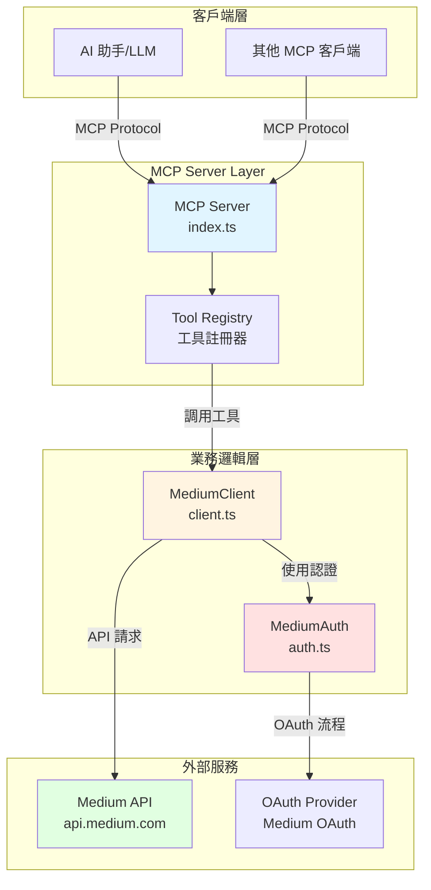
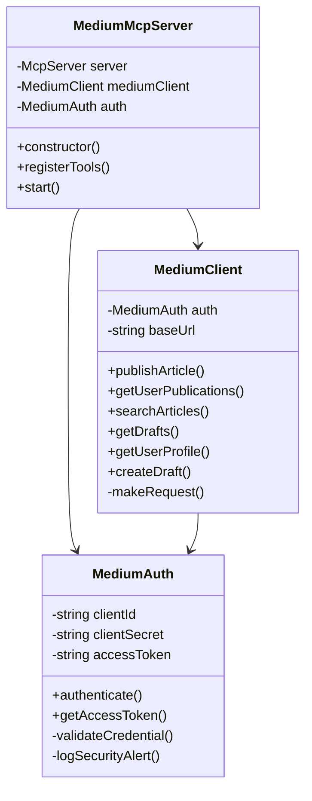
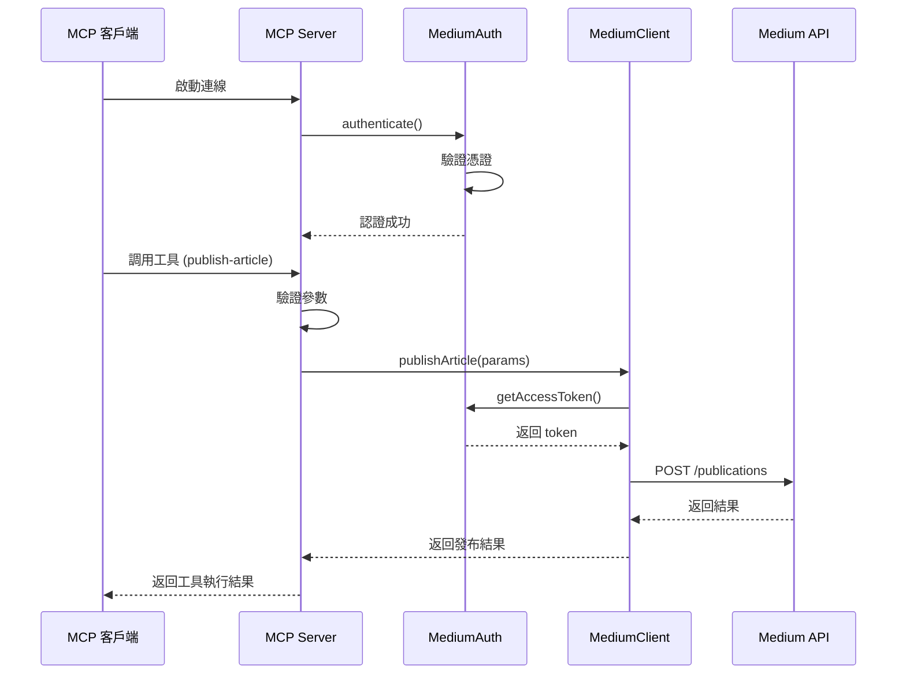
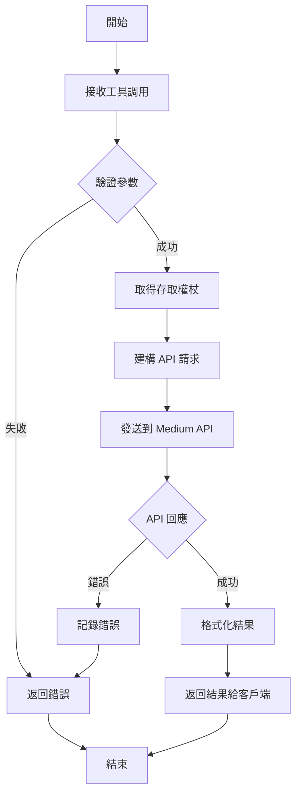
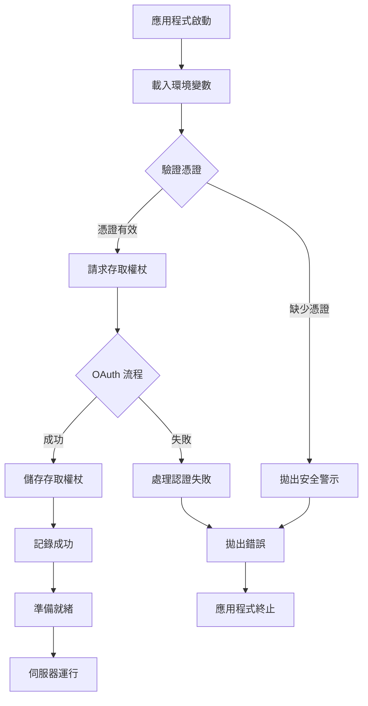
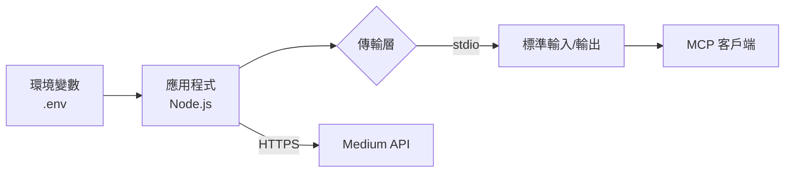

# Medium MCP Server 系統架構文件

## 📋 目錄
1. [系統概述](#系統概述)
2. [系統架構圖](#系統架構圖)
3. [核心元件說明](#核心元件說明)
4. [資料流程](#資料流程)
5. [API 設計](#api-設計)
6. [程式設計模式](#程式設計模式)

## 系統概述

Medium MCP Server 是一個基於模型上下文協議（Model Context Protocol, MCP）的伺服器應用程式，提供與 Medium 平台互動的程式化介面。此系統允許 AI 助手和其他應用程式透過標準化的 MCP 協議來發布文章、搜尋內容及管理 Medium 出版物。

### 主要特點
- **標準化協議**：採用 MCP 標準，提供一致的工具介面
- **OAuth 認證**：安全的 Medium OAuth 2.0 認證流程
- **模組化設計**：清晰的職責分離與可維護性
- **TypeScript 實作**：型別安全與現代化開發體驗

## 系統架構圖

### 整體架構



### 類別關係圖



### 工具流程圖



## 核心元件說明

### 1. MediumMcpServer (index.ts)
**職責**：MCP 伺服器的主要入口點和協調器

**主要功能**：
- 初始化 MCP 伺服器實例
- 註冊所有可用的工具
- 管理伺服器生命週期
- 協調認證和客戶端元件

**提供的工具**：
1. `publish-article`：在 Medium 上發布新文章
2. `get-publications`：取得使用者的出版物列表
3. `search-articles`：搜尋和篩選 Medium 文章

### 2. MediumAuth (auth.ts)
**職責**：處理 Medium OAuth 認證流程

**主要功能**：
- 驗證環境變數中的憑證
- 執行 OAuth 2.0 認證流程
- 管理存取權杖的生命週期
- 提供安全警示日誌

**安全特性**：
- 憑證驗證與錯誤處理
- 安全警示記錄
- 權杖存取控制

### 3. MediumClient (client.ts)
**職責**：與 Medium API 進行互動的客戶端

**主要功能**：
- 統一的 API 請求處理
- 錯誤處理與記錄
- 支援多種 Medium API 端點

**支援的操作**：
- 發布文章
- 取得使用者出版物
- 搜尋文章
- 管理草稿
- 取得使用者個人資料

## 資料流程

### 發布文章流程



### 認證流程



## API 設計

### 工具介面規範

#### 1. publish-article

**描述**：在 Medium 上發布新文章

**參數**：
```typescript
{
  title: string;        // 必填，最少 1 字元
  content: string;      // 必填，最少 10 字元
  tags?: string[];      // 選填，文章標籤陣列
  publicationId?: string; // 選填，出版物 ID
}
```

**回應**：
```typescript
{
  content: [{
    type: "text",
    text: string // JSON 格式的發布結果
  }]
}
```

#### 2. get-publications

**描述**：取得使用者的出版物

**參數**：無

**回應**：
```typescript
{
  content: [{
    type: "text",
    text: string // JSON 格式的出版物列表
  }]
}
```

#### 3. search-articles

**描述**：搜尋和篩選 Medium 文章

**參數**：
```typescript
{
  keywords?: string[];      // 選填，搜尋關鍵字
  publicationId?: string;   // 選填，出版物篩選
  tags?: string[];          // 選填，標籤篩選
}
```

**回應**：
```typescript
{
  content: [{
    type: "text",
    text: string // JSON 格式的文章列表
  }]
}
```

## 程式設計模式

### 1. 單一職責原則 (Single Responsibility Principle)
每個類別都有明確且單一的職責：
- `MediumMcpServer`：伺服器協調
- `MediumAuth`：認證管理
- `MediumClient`：API 互動

### 2. 依賴注入 (Dependency Injection)
```typescript
// MediumClient 接收 MediumAuth 作為依賴
constructor(auth: MediumAuth) {
    this.auth = auth;
}
```

### 3. 錯誤處理模式
統一的錯誤處理機制：
```typescript
try {
    // 業務邏輯
} catch (error: any) {
    return {
        isError: true,
        content: [{
            type: "text",
            text: `錯誤訊息: ${error.message}`
        }]
    };
}
```

### 4. 環境配置模式
使用 `dotenv` 管理環境變數，將配置與程式碼分離。

### 5. 建構器模式 (Builder Pattern)
在 API 請求中使用查詢參數建構器：
```typescript
const queryParams = new URLSearchParams();
params.keywords?.forEach(keyword => 
    queryParams.append('q', keyword)
);
```

## 技術堆疊詳細說明

### 核心依賴
1. **@modelcontextprotocol/sdk**: MCP 協議實作
2. **axios**: HTTP 客戶端，用於 API 請求
3. **dotenv**: 環境變數管理
4. **zod**: 執行期型別驗證和模式定義

### 開發工具
1. **TypeScript**: 靜態型別檢查
2. **ts-node-dev**: 開發期間的即時重載
3. **Jest**: 單元測試框架

## 部署架構



### 環境需求
- Node.js v16 或更新版本
- npm 或 yarn 套件管理器
- Medium API 開發者憑證

### 配置需求
```env
MEDIUM_CLIENT_ID=your_client_id
MEDIUM_CLIENT_SECRET=your_client_secret
MEDIUM_CALLBACK_URL=http://localhost:3000/callback
```

## 擴展性設計

系統設計考慮了未來的擴展需求：

1. **新增工具**：在 `registerTools()` 方法中輕鬆新增新的 MCP 工具
2. **新增 API 方法**：在 `MediumClient` 中新增新的 Medium API 互動
3. **認證擴展**：`MediumAuth` 可擴展以支援其他認證機制
4. **傳輸層替換**：可將 stdio 傳輸層替換為 HTTP 或 WebSocket

## 總結

Medium MCP Server 採用了清晰的分層架構和模組化設計，確保了：
- **可維護性**：清晰的職責分離
- **可擴展性**：易於新增功能
- **安全性**：完善的認證和錯誤處理
- **標準化**：遵循 MCP 協議規範

此架構為未來的功能擴展和維護提供了堅實的基礎。
